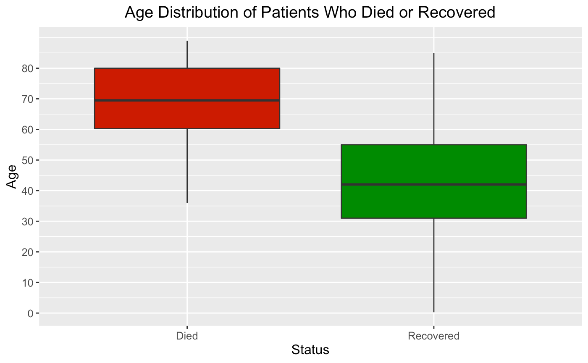
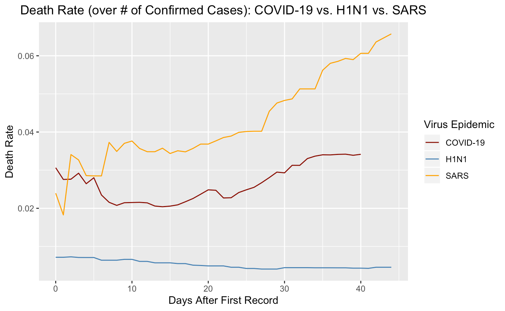
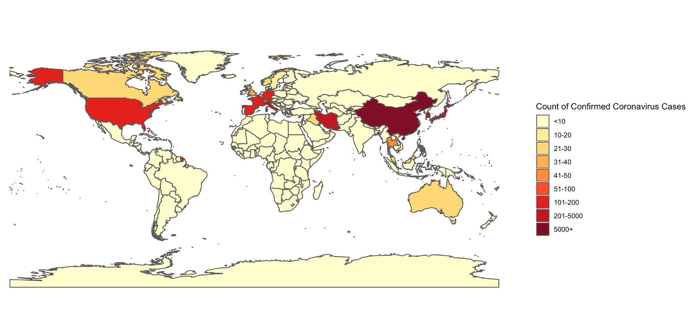
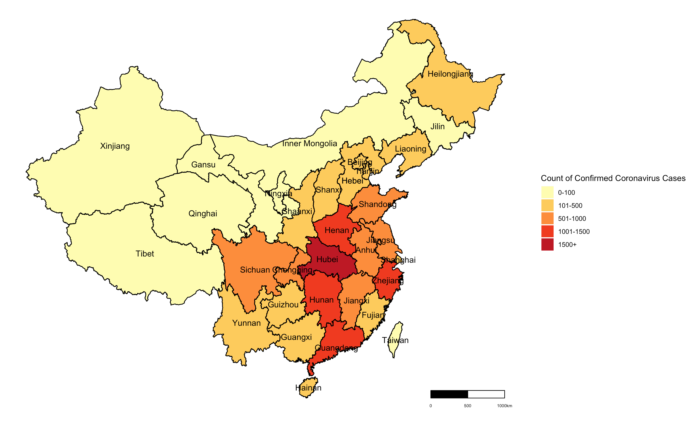
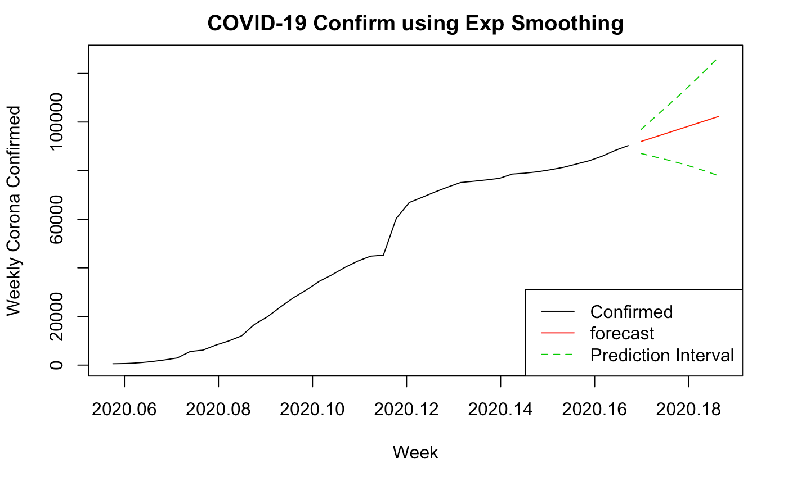
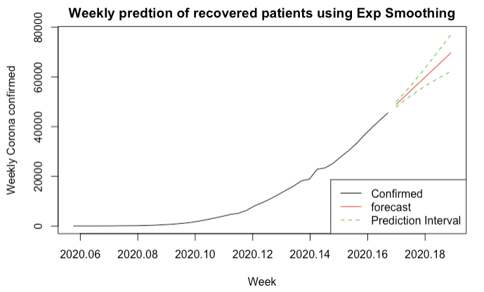
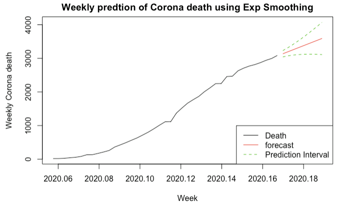

# Introduction

**Background**

The 2019-2020 coronavirus outbreak is an ongoing worldwide pandemic caused by the novel coronavirus disease (COVID-19). The disease has been detected in at least 87 countries, with almost 100,000 cases, as of March 5, 2020. As a respiratory illness, COVID-19’s ability to easily spread from person-to-person and the severity of its symptoms have caused major health concerns. 

**Objective**

By assessing the risks and forecasting the spread of COVID-19, our main goal is to investigate the spread of the disease in different countries, find patterns within the multitude of recorded cases, and understand the threats associated with the virus at its current state and the future. 

# Insights

The median age of people with confirmed cases of the disease is 51 years old, with most affecting those in their 30s to 60s.

Elderly people are more at risk of death, with the median age around 70 years old. While fever, cough, and sore throat are listed as the most common symptoms of the disease, around 65.07% of the deaths occurred due to another associated symptom, pneumonia. In comparison, only about 2.5% of patients who recovered had pneumonia. 

{width=1000px}

 The symptoms typically manifest approximately after a week or two after exposure to the virus. Those who died tend to make a visit to a hospital after symptom onset less quickly than those who recovered. We found that the average number of days that people make a visit to the hospital after seeing symptoms has not decreased over time. 

 With concerns growing, information about previous pandemics is important to put the current coronavirus outbreak into perspective. The number of deaths from coronavirus has already exceeded the deaths of the 2009 H1N1 and the 2003 SARS outbreaks, when compared to the same time interval since official recording started. While the number of deaths might exceed that of the other two, COVID-19’s death rate has been lower than that of the SARS outbreak.

{width=1000px}

As of 3/2/2020, the most affected country is China, followed by South Korea, Italy, Iran, and Japan. 

{width=1000px}

 The following map shows the severity of the outbreak in different provinces in China. Hubei, the province where the virus originated, and its surrounding areas, have the most cases.

{width=1000px}

# Forecasting

Until the mid February 2020, the number of people confirmed with COVID-19 has shown a dramatic increase while the number of people who recovered has increased, but not in a significant rate.

{width=1000px}
 
As of early March, more than half of the people who tested positive for the coronavirus have recovered.

# Time series analysis
{width=1000px}

With the growing awareness of disease, time series forecasting shows the flat prediction line of confirmed patients by April, 2020.

{width=1000px}

Using exponential smoothing method, time series forecasting shows the increasing prediction line of confirmed patients by April, 2020.

{width=1000px}

Using exponential smoothing method, time series forecasting shows the increasing prediction line of reported death of the patients by April, 2020.

# Conclusion
Outbreaks of infectious diseases like the coronavirus around the world are always of public health concern. As shown in the world map created based on geostatistcal analysis, this outbreak started in China in late 2019 and by March 2020, the disease has spread to many countries around the world. The time series analysis has shown that the number of new cases will be evening out by April. However, this analysis is largely driven by cases in China and due to the novelty of coronavirus, our time series analysis has limitations. The analysis we see may be due to the fact that the number of new cases in China is evening out, but this may not necessarily be the case for other countries.

# References
- “2019 Novel Coronavirus (2019-NCoV) Situation Summary.” Centers for Disease Control and Prevention. Centers for Disease Control and Prevention, March 9, 2020. https://tinyurl.com/s6aarjq.
- Devakumar, K.P. “SARS 2003 Outbreak Complete Dataset.” Kaggle, February 26, 2020. https://tinyurl.com/tm9khn6.
- Kumar, S.R. “Novel Corona Virus 2019 Dataset.” Kaggle, 10 Mar. 2020, https://tinyurl.com/uhglqt3.
- Lyn, J.W. “Pandemic 2009 H1N1 Swine Flu Influenza A Dataset.” Kaggle, February 9, 2020. https://tinyurl.com/t63zubt.